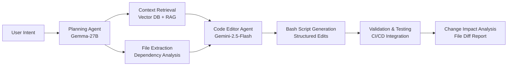

# 🤖 Multi-Agent AI Code Editor & Repository Intelligence System

> **A cutting-edge multi-agent framework for intelligent, repository-level code generation and editing using Large Language Models (LLMs)**

## 🎯 Project Vision

We're building the next generation of AI-powered code assistants that can understand, plan, and execute complex repository-level changes with human-like intelligence. Our multi-modal approach combines **intent understanding**, **contextual planning**, and **precise code generation** to revolutionize how developers interact with large codebases.

## 🏗️ System Architecture



### 🧠 Two-Agent Pipeline Design

#### **Agent 1: Repository Intelligence & Planning** (`Gemma-27B`)
- **Context Window**: 30-40K tokens for full project understanding
- **Core Responsibilities**:
  - Parse and understand user intentions (e.g., "make homepage more beautiful")
  - Perform semantic analysis of the entire codebase
  - Extract relevant files and dependencies using graph-based analysis
  - Generate a structured change plan with impact assessment
  - Identify potential side effects and affected components

#### **Agent 2: Code Generation & Execution** (`Gemini-2.5-Flash`)
- **Input**: Focused file contexts + structured edit plan
- **Output**: Executable bash scripts with precise file modifications
- **Features**:
  - Generate atomic, reversible code changes
  - Create validation scripts and test runners
  - Produce detailed change manifests
  - Handle dependency updates and imports

## 🔬 Research Innovation

### Novel Contributions
1. **Hybrid Context Engineering**: Combines repository-wide understanding with focused editing
2. **Multi-Modal Code Intelligence**: Integrates AST analysis, semantic search, and LLM reasoning
3. **Executable Change Plans**: Generates bash-based automation for instant deployment
4. **Dependency-Aware Editing**: Tracks and validates cross-file impacts
5. **Incremental Validation**: CI/CD integration with rollback capabilities

### Research Domains
- **Repository-Level Code Generation** - Moving beyond single-function tasks
- **Multi-Agent LLM Orchestration** - Specialized agent collaboration
- **Context-Aware Code Editing** - Intelligent file selection and modification
- **Automated Software Engineering** - End-to-end development automation

## 📊 Current State & Benchmarks

| Component | Status | Performance Target |
|-----------|--------|-------------------|
| Intent Parser | 🟡 Prototyping | 90%+ intent accuracy |
| Context Retrieval | 🟡 Development | Sub-second file extraction |
| Code Generation | 🟡 Testing | 70%+ first-pass success |
| Validation Pipeline | 🟡 Design Phase | Zero-downtime deployment |
| Multi-Modal Interface | 🔴 Research Phase | Screenshot → Code changes |

## 🛠️ Technology Stack

### Core Models
- **Planning Agent**: Gemma-27B (Repository understanding, intent parsing)
- **Code Agent**: Gemini-2.5-Flash (High-speed code generation)
- **Fallback Models**: CodeT5+, StarCoder, Code Llama

### Infrastructure
- **Vector Database**: Pinecone/Weaviate for code embeddings
- **Graph Analysis**: NetworkX for dependency mapping  
- **Execution Environment**: Docker containers for safe code testing
- **Version Control**: Git integration with automated branching
- **CI/CD**: GitHub Actions for validation pipelines

### Development Stack
- **Backend**: Python (FastAPI), Node.js (for JavaScript analysis)
- **Frontend**: Next.js (developer interface), React components
- **Database**: PostgreSQL (metadata), Redis (caching)
- **Queue System**: Celery/RQ for async processing

## 🎯 Research Opportunities

### 🔥 High-Impact Areas

#### **Multi-Modal Code Understanding**
- Screenshot-to-code generation for UI modifications
- Voice commands for natural language programming
- IDE integration with real-time collaboration

#### **Advanced Planning Algorithms**
- Reinforcement learning for optimal edit sequences
- Graph neural networks for dependency prediction
- Evolutionary algorithms for code optimization

#### **Validation & Testing**
- Automated test generation for code changes
- Property-based testing integration
- Formal verification of critical modifications

#### **Human-AI Collaboration**
- Interactive debugging and refinement loops
- Explainable AI for code change decisions
- Progressive disclosure of complex modifications

### 🧪 Experimental Areas

1. **Few-Shot Repository Adaptation** - Quick customization to new codebases
2. **Cross-Language Code Migration** - Automatic porting between tech stacks  
3. **Security-Aware Code Generation** - Built-in vulnerability prevention
4. **Performance-Optimized Edits** - Automatic efficiency improvements
5. **Documentation-Driven Development** - Spec-to-code generation

## 🚀 Getting Started

### Prerequisites
```bash
# Python 3.9+, Node.js 18+, Docker
pip install -r requirements.txt
npm install
docker-compose up -d
```

### Quick Demo
```python
from multi_agent_editor import RepositoryEditor

editor = RepositoryEditor(
    planning_model="gemma-27b",
    code_model="gemini-2.5-flash",
    repo_path="./your-project"
)

# Natural language editing
result = editor.edit(
    intent="Make the homepage section more beautiful with modern CSS",
    validate=True,
    auto_apply=False
)

print(f"Files modified: {result.affected_files}")
print(f"Bash script: {result.executable_script}")
```

## 🤝 How to Contribute

### For AI/ML Researchers
- **Model Architecture**: Improve agent specialization and coordination
- **Benchmarking**: Create evaluation datasets for repository-level tasks
- **Optimization**: Reduce latency and improve accuracy metrics

### For Software Engineers  
- **Tool Integration**: IDE plugins, CLI tools, web interfaces
- **Infrastructure**: Scalable deployment and monitoring systems
- **Security**: Safe code execution and validation frameworks

### For Academic Collaborators
- **Publications**: Co-author papers on multi-agent code generation
- **Datasets**: Contribute labeled repository-level editing tasks
- **Evaluation**: Design metrics for measuring code quality and correctness

## 📚 Research Foundation

### Key Papers & Inspiration
- [MASAI: Modular Architecture for Software Engineering AI](https://arxiv.org/abs/2406.11638) - Multi-agent SWE-Bench results
- [CodePlan: Repository-level Coding using LLMs and Planning](https://arxiv.org/abs/2309.12499) - Planning framework
- [MapCoder: Multi-Agent Code Generation for Competitive Problem Solving](https://aclanthology.org/2024.acl-long.269/) - Agent coordination
- [A3-CodGen: Repository-Level Code Generation Framework](https://arxiv.org/abs/2312.05772) - Context engineering

### Citing Our Work
```bibtex
@misc{multi_agent_code_editor_2025,
  title        = {Multi-Agent AI Code Editor: Repository-Level Intelligence for Modern Software Development},
  author       = {Vijay Kumar and contributors},
  year         = {2025},
  howpublished = {GitHub repository},
  url          = {https://github.com/Be1newinner/multi-model-code-editor-agents},
  note         = {Accessed: 2025-08-25}
}
```

## 🎖️ Recognition & Impact

### Research Goals
- **ICML/NeurIPS 2026**: Multi-agent software engineering track
- **Industry Adoption**: Integration with major IDEs and dev tools
- **Open Source Impact**: 10K+ stars, 100+ contributors
- **Developer Productivity**: 40%+ reduction in routine coding tasks

### Success Metrics
- Repository-level task success rate: **60%+** (current SOTA: 28%)
- Code generation latency: **<5 seconds** for complex changes  
- Developer satisfaction: **4.5/5** in user studies
- Deployment safety: **99.9%** successful validations

## 🌟 Join Our Research Community

### Research Funding & Partnerships
We're actively seeking:
- **Academic Collaborations**: Joint research projects and publications
- **Industry Partnerships**: Real-world validation and deployment
- **Grant Opportunities**: NSF, EU Horizon, corporate research programs
- **Talent Pipeline**: PhD students, postdocs, research engineers

## 🏆 Call to Action

**Are you excited about the future of AI-assisted software development?**

Whether you're a researcher pushing the boundaries of multi-agent systems, a developer building the next generation of coding tools, or a student eager to contribute to cutting-edge AI research—we want you on our team.


**🚀 Ready to revolutionize code editing with AI?** 


*Last updated: August 2025 • Next milestone: September 2025 demo*
